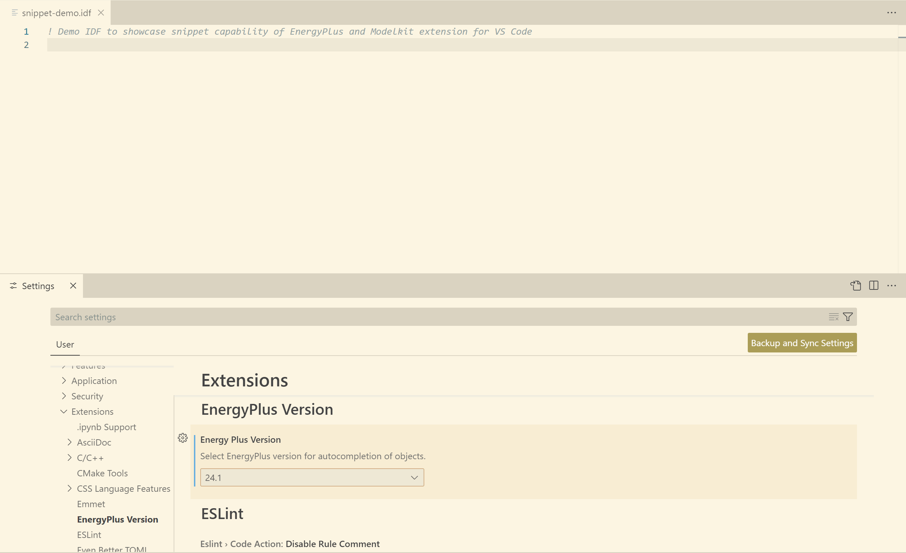
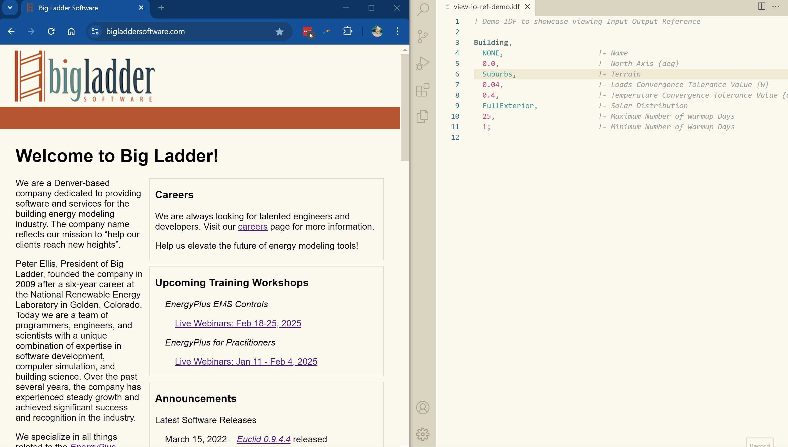

# EnergyPlus & Modelkit Language Support

Syntax highlighting with auto-completion of model objects and code snippets for EnergyPlus and Modelkit files.

## Features

### Snippets

This extension leverages snippets to do various processes related to EnergyPlus objects. First, select the EnergyPlus version that you would like to work with under *File / Preferences / Settings / Extensions / EnergyPlus Version*. Once selected, you should see a notification window appear when viewing EnergyPlus files.

Now, you will be able to auto-complete EnergyPlus objects from your selected version with input fields set to default values. Input fields that do not have default values and require user input are auto-completed with "???".

To use EnergyPlus snippets, type in the object class name, then select the appropriate object class name preceded by the box snippets icon by clicking on it or using arrow keys to highlight the desired object and then hit the `Tab` or `Enter` key.

Before auto-completing an object, at the right of the auto-complete window you will be able to see an extended preview of:

- A preview of the object's input fields
- A link to the Input Output Reference documentation for that object
- A description of what that object represents in the building energy model, which is taken from the EnergyPlus Input Data Dictionary (IDD) file

You can toggle this extended preview feature by clicking the `>` icon at the right of the snippet list.

After auto-completing an object, you can use the `Tab` key to progress through each input field and update its value.

The gif below shows an example of:

- Updating the **EnergyPlus Version** setting
- Using snippets to generate a ***Version*** and ***Building*** object
- Using up/down arrows to navigate through snippets
- Toggling the extended preview feature of snippets
- Updating input fields of the ***Building*** object with the `Tab` key after auto-completing
- Using `Esc` key to exit the process of updating input fields

This extension also leverages snippets to auto-complete typical code blocks used in Modelkit projects. Code block components that require user input are auto-completed with "???".

To use Modelkit snippets, type in the initial characters of the code black you want to insert. Select the appropriate snippet in the auto-complete window the same way you would for an EnergyPlus snippet. Note that there are different snippets whether you want to insert code already bound by Ruby brackets or insert code with new Ruby brackets. Finally, you can use both EnergyPlus and Modelkit snippets within Modelkit files.

### Toggle Comments

This extension enables the **Toggle Line Comment** command in VS Code found under the *Edit / Toggle Line Comment* menu (keybinding: `ctrl` + `/`) to toggle EnergyPlus comments (lines starting with "!").

Additionally, this extenion includes two commands for toggling comments: **Toggle EnergyPlus Comments** for adding and removing "!" from the beginning of lines in IDF, IMF, and PXT files, and **Toggle Modelkit Comments** for adding and removing "#" from the beginning of lines in IMF and PXT files. There are three options for accessing these commands:

- From the *View / Command Pallette* menu (keyboard shortcut: `Ctrl` + `Shift` + `P`)
- From the context menu found by right-clicking within an active file
- Using keybindings (`Shift` + `Ctrl` + `1` for **Toggle EnergyPlus Comments** and `Shift` + `Ctrl` + `3` for **Toggle Modelkit Comments**)

These commands can be used for a single line or multiple selected lines. If multiple lines are selected, the extension will evaluate each line separately to know whether to add or remove the comment character. This is different behavior than the native **Toggle Line Comment** command in VS Code (if any selected line is NOT commented, adds comment character to ALL lines).

The keybindings are defined in `package.json` under `contributes:keybindings` and can be reconfigured, if you desire.

### View Input Output Reference

This extension includes a **View Input Output Reference** command, which can open an internet browser window outside of VS Code for the selected text of the object class and corresponding **EnergyPlus Version** setting. There are two options for accessing these commands:

- From the *View / Command Pallette* menu (keyboard shortcut: `Ctrl` + `Shift` + `P`)
- From the context menu found by right-clicking within an active file

This feature is also available in the extended preview of the snippet for each object class by clicking on **Input Output Reference**.

## See [Change Log](CHANGELOG.md) for release notes
